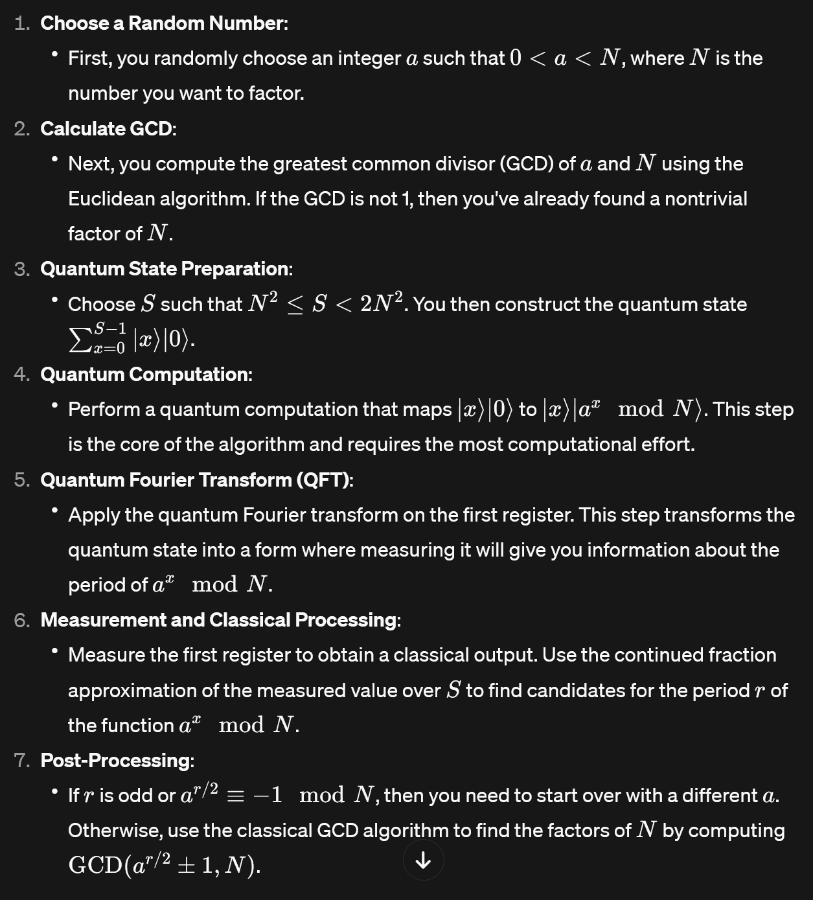

# Quantum Factoring with Shor's Algorithm

## Introduction  
This project demonstrates integer factoring using quantum computing, inspired by notable research. It showcases Shor's algorithm's efficiency compared to classical methods.

## Shor's algorithm

